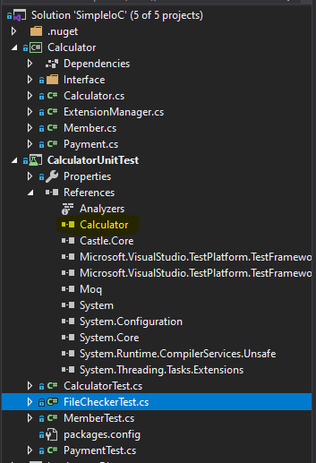
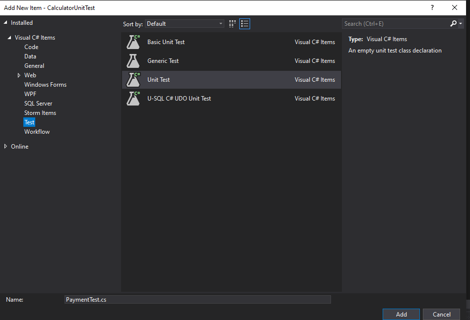
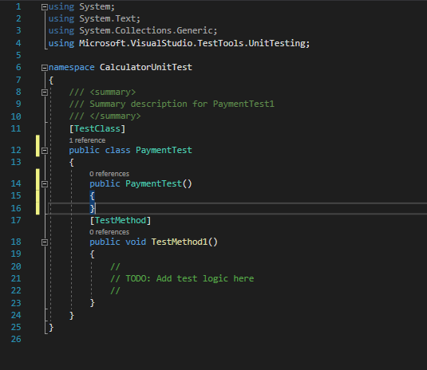
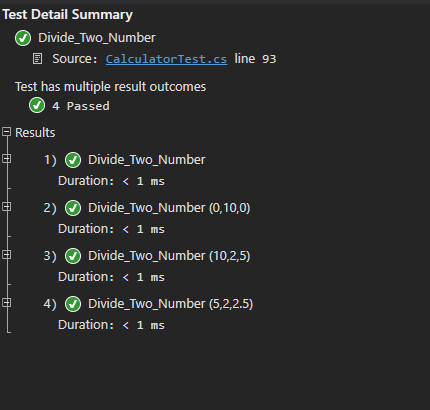

# 1.Tạo và chạy unit test với MS unit test framework.
# a.Tạo project test.
Tại solution chứa project code ta tạo thêm thêm project test theo các bước sau:
- 1: Click vào File menu, chọn Add, và chọn New Project.
- 2: Trong New Project dialog box, chọn Installed, chọn Visual C#, và chọn Test.
- 3: trong danh sách, chọn Unit Test Project.
- 4: Trong Name box, đặt tên cho project, và chọn OK.
- 5: Trong test project, add reference đến project code (project bạn muốn viết Unit test) trong solution.

# b.Tạo test class
- Trong project test , chuột phải chọn **Add**, chọn **New Item** , Chọn tab **Test**, chọn **Unit Test**.
- Đặt tên file unit test tương ứng với class, hoặc function bạn đang muốn test ví dụ: Test cho class Payment chúng ta đặt tên tương ứng là PaymentTest.cs

Ta tạo được một file với nội dung như sau: 

Yêu cầu của một test class:
- Luôn using đến library: Microsoft.VisualStudio.TestTools.UnitTesting
- attribute [TestClass] là bắt buộc trong Microsoft unit testing framework để khai báo rằng đây là một class test,chứa các test method.
- [TestMethod] dùng để khai báo rằng phương thức này là một phương thức test.
# C. Tạo test method
Một số lưu ý khi tạo test method:
- Test method phải có attribute [TestMethod].
- Test method không có tham số
- Test method không có kiểu dữ liệu trả về.
- Ta thường sử dụng AAA (Arrange, Act, Assert) pattern viết unit test method
	- **Arrange**: Thiết lập các điều kiện cần thiết: khởi tạo các đối tượng, xác định tài nguyên cần thiết, xây dựng các dữ liệu giả,…
	- **Act**: Gọi đến các phương thức cần kiểm tra.
	- **Assert**:Kiểm tra sự hoạt động đúng đắn của các phương thức
# d. Sample
Ta có function chia 2 số:
```sh
  public float Divide(float a, float b)
        {
            if (b == 0)
            {
                throw new InvalidOperationException("the dividend can not be zero");
            }
            return a / b;
        }

```

Qua phân tích ta thấy function này có ít nhất 5 case cần test:
- Chia 2 số nguyên
- Chia 2 số thực
- Số chia là 0
- Chia cho 0 để method ném ra exception.
- Chia cho 0 để method ném ra exception, kiểm tra nội dung message.
```sh
 //Test exception
        [TestMethod]
        public void Divide_Zero()
        {
            Calculator.Calculator cal = new Calculator.Calculator();
            Assert.ThrowsException<InvalidOperationException>(() => cal.Divide(10, 0));
        }

        //Test exception message
        [TestMethod]
        public void Divide_Error_Message()
        {
            Calculator.Calculator cal = new Calculator.Calculator();
           var ex = Assert.ThrowsException<InvalidOperationException>(() => cal.Divide(10, 0));
            Assert.AreEqual("the dividend can not be zero",ex.Message);
        }

        [TestMethod]
        public void Divide_Two_Number_Not_Zero()
        {
            Calculator.Calculator cal = new Calculator.Calculator();
            float quotient = cal.Divide(10, 2);
            Assert.AreEqual(5,quotient);
        }

        [TestMethod]
        public void Divide_Quotient_Float()
        {
            Calculator.Calculator cal = new Calculator.Calculator();
            float quotient = cal.Divide(5, 2);
            Assert.AreEqual(2.5f, quotient);
        }

 [TestMethod]
        public void Divide_With_Divisor_Is_Zero()
        {
            Calculator.Calculator cal = new Calculator.Calculator();
            float quotient = cal.Divide(0, 2);
            Assert.AreEqual(0,quotient);
        }
```
# e. DataTestMethod 
Tuy nhiên ta thấy, để kiểm tra 3 case là: 
- Chia 2 số nguyên
- Chia 2 số thực
- Số chia là 0
Việc tách ra làm 3 test method khá rườm rà, tuy nhiên bằng việc tạo DataTestMethod ta có thể kiểm tra 3 trường hợp trên trong một method.
```sh
[DataTestMethod]
 [DataRow(0,10,0)]
 [DataRow(10,2,5)]
 [DataRow(5,2,2.5f)]
  public void Divide_Two_Number(float divisor, float dividend, float expectedResult)
  {
            Calculator.Calculator cal = new Calculator.Calculator();
            float quotient = cal.Divide(divisor, dividend);
            Assert.AreEqual(expectedResult, quotient);
  }

```
Khi chạy test ta có kết quả sau:

DataTestMethod có chút khác biệt so với TestMethod như sau:
- Có tham số: trong đó các tham số tương ứng với tham số của function, method cần test, tham số cuối cùng chính là kết quả mong muốn nhận được khi thực thi function, method.
- Mỗi một DataRow tương ứng với một case cần test.
- Tuy nhiên cần lưu ý rằng, kiểu dữ liệu sử dụng trong DataRow chỉ nhận các kiểu dữ liệu nguyên thủy: boolean , char , byte , short ,int ,long , float, double.
Việc sử dụng DataTestMethod thực sự có ý nghĩa trong việc test với các giá trị biên, với các function chứa nhiều logic if-else, switch-case.
---
1. [Giới thiệu về unit test](./01-introduction-to-unit-testing.md)
2. [MS Unit test framework](./02-msunitest-framework.md)
3. [Mock object](./03-mock-object.md)
4. [Unit test với Dependency Injection](./04-dependency-injection.md)
---