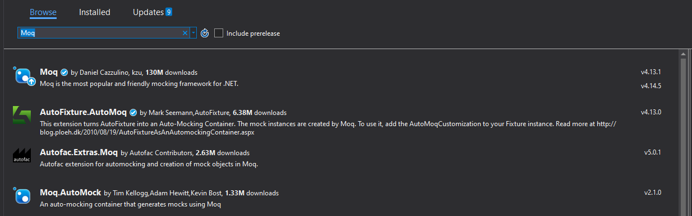
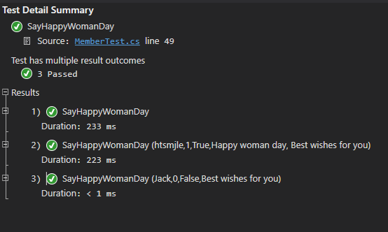

# Mock Object
Trên thực tế, các function thường phức tạp hơn ví dụ trên rất nhiều, kết hợp lồng ghép, goi tới xử lý của function khác. Lúc này để viết test method, ta thường sử dụng Mock Object.
Vậy mock object là gì?
**Mock object (MO)** là một đối tượng ảo, mô phỏng các tính chất và hành vi giống hệt như đối tượng thực được truyền vào bên trong khối mã đang vận hành nhằm kiểm tra tính đúng đắn của các hoạt động bên trong.
Thay vì lấy data từ một real service, chúng ta sử dụng một bộ test data mà input và output đã được định nghĩa rõ ràng từ một Mock Object và chúng ta có thể dùng nó cho đối tượng muốn test.
MO được sử dụng trong các trường hợp sau:
- Khi cần lập trạng thái giả của một đối tượng thực trước khi các UT có liên quan được đưa vào vận hành (thí dụ kết nối cơ sở dữ liệu, giả định trạng thái lỗi server,…).
- Khi cần lập trạng thái cần thiết cho một số tính chất nào đó của đối tượng đã bị khoá quyền truy cập (các biến, thủ tục, hàm, thuộc tính riêng được khai báo private). Không phải lúc nào các tính chất của một đối tượng cũng có thể được mở rộng phạm vi truy cập ra bên ngoài vì điều này có thể trực tiếp phá vỡ liên kết giữa các phương thức theo một trình tự sắp đặt trước, từ đó dẫn đến kết quả có thể bị xử lý sai. Tuy nhiên, MO có thể thiết lập các trạng thái giả mà vẫn đảm bảo các yêu cầu ràng buộc, các nguyên tắc đúng đắn và các quan hệ của đối tượng thực.
- Khi cần kiểm tra một số thủ tục hoặc các biến của thành viên bị hạn chế truy cập. Bằng cách kế thừa MO từ đối tượng thực chúng ta có thể kiểm tra các thành viên đã được bảo vệ (khai báo protected).
- Khi cần loại bỏ các hiệu ứng phụ của một đối tượng nào đó không liên quan đến UT.
- Khi cần kiểm nghiệm mã vận hành có tương tác với hệ thống bên ngoài.
Đối với những function phức tạp hơn, phải gọi đến một function khác để xử lý, ta kết hợp với mock object để thực hiện unit test.
# 1.Cài đặt Moq
Ta cần cài đặt **Moq** từ Nuget để sử dụng mock object.



# 2. Sample
Ta viết unit test cho function HappyWomanday, trong function này có gọi đến function IsFemaleMember, kiểm tra xem member có phải giới tính là nữ hay không.
```sh
**IMemer.cs**  
public interface IMember
    {
        
        bool IsFemaleMember(Member member);
        string HappyWomanday(Member member);
    }

**Member.cs**
  public class Member : IMember
    {
        private string _name { get; set; }
        private int _gender { get; set; }
        private IMember _member;
        public Member(string name, int gender)
        {
            _name = name;
            _gender = gender;
        }

        public Member(IMember member)
        {
            _member = member;
        }
        public Member()
        {

        }

public string HappyWomanday(Member member)
        {
            string wishes = "Best wishes for you";
            if (_member.IsFemaleMember(member))
            {
                wishes = "Happy woman day, " + wishes;
            }
            return wishes;
        }

        public bool IsFemaleMember(Member member)
        {
            if (member == null) throw new Exception("Invalid member");
            return member._gender == (int)Gender.Female ? true : false;
        }
}
```
Test method:
```sh
[DataTestMethod]
        [DataRow("htsmjle", (int)Gender.Female,true, "Happy woman day, Best wishes for you")]
        [DataRow("Jack", (int)Gender.Male, false, "Best wishes for you")]
        public void SayHappyWomanDay(string name, int gender, bool status, string expectedResult)
        {
            Member data = new Member(name, gender);
            Mock<IMember> mockMem = new Mock<IMember>();
            mockMem.Setup(m => m.IsFemaleMember(data)).Returns(status);
            Member mem = new Member(mockMem.Object);
            var result = mem.HappyWomanday(data);
            Assert.AreEqual( expectedResult, result);
        }

```
Ở đây, ta sử dụng mock để giả lập kết quả trả về cho function IsFemaleMember theo data được set.



**Moq** cung cấp một số method để xác nhận rằng các kỳ vọng đã được đáp ứng.
- Verify(): Xác minh rõ ràng từng kỳ vọng, ví dụ:
	- mockMem.Verify(m => m.IsFemaleMember(It.IsAny<Member>()));
- VerifyAll(): Xác nhận rằng tất cả các kỳ vọng đều được đáp ứng.
Như ví dụ trên đây, test method sẽ trả ra exception nếu test code không gọi đến function IsFemaleMember.

---
1. [Giới thiệu về unit test](./01-introduction-to-unit-testing.md)
2. [MS Unit test framework](./02-msunitest-framework.md)
3. [Mock object](./03-mock-object.md)
4. [Unit test với Dependency Injection](./04-dependency-injection.md)
---