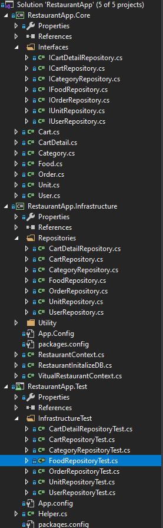

# Dependency Injection
Dependency Injection là một kiểu của Inversion of Control (IoC), là một kỹ thuật giảm thiểu sự phụ thuộc của các đối tượng trong một project của mình. 
Cho phép các thành phần phụ thuộc (các thành phần khác, các service trong chương trình) được inject (tiêm) trực tiếp từ container vào một constructor (hàm khởi dựng) hoặc một thuộc tính công khai (public properties) của một class phụ thuộc vào chúng.
Ta có thể kết hợp hiểu quả kỹ thuật DI cùng với Mock để test các method cần làm việc với database như thêm, sửa, xóa, filter data.

Cấu trúc source code:



Tầng core: 
- Chứa các entity model
- Định nghĩa interface

Tầng infra:
- Chứa các repo xử lý logic
- DB context tương tác với database

Để thực hiện viết unit test ta tạo một class Vitual DbContext extend từ DBContext.
```sh
public VitualRestaurantContext() : base("name=RestaurantAppConnectionString")
        {
            Configuration.LazyLoadingEnabled = true;
        }
        public virtual DbSet<Food> Food { get; set; }
        public virtual DbSet<Category> Category { get; set; }
        public virtual DbSet<Cart> Cart { get; set; }
        public virtual DbSet<CartDetail> CartDetail { get; set; }
        public virtual DbSet<Order> Order { get; set; }
        public virtual DbSet<User> User { get; set; }
        public virtual DbSet<Unit> Unit { get; set; }

        public virtual void SetModified(object entity)
        {
            Entry(entity).State = System.Data.Entity.EntityState.Modified;
        }


```
```sh
**Interface**:
 public interface IFoodRepository
    {
        void Update(Food food);
        bool Remove(int id);
        IEnumerable<Food> GetFoods(int type, int page, int pageSize);
        Food GetById(int id);
    }

**Repository**:
 public class FoodRepository : RestaurantApp.Core.Interfaces.IFoodRepository
    {
        private VitualRestaurantContext _context;
        public FoodRepository(VitualRestaurantContext context)
        {
            _context = context;
        }

        public Food GetById(int id)
        {
            var result = (from f in _context.Food
                          where f.Id == id
                          select f).FirstOrDefault();
            return result;
        }

        public IEnumerable<Food> GetFoods(int type, int page, int pageSize)
        {
            IEnumerable<Food> list = (from f in _context.Food
                                      where f.Type == type
                                      orderby f.Name ascending
                                      select f)
                                      .Skip(pageSize * page)
                                      .Take(pageSize)
                                      .ToList();
            return list;
        }

        public bool Remove(int id)
        {
            if (id <= 0) return false;
            Food food = _context.Set<Food>().Find(id);
            if (food == null) return false;
            _context.Set<Food>().Remove(food);
            _context.SaveChanges();
            return true;
        }
        public void Update(Food food)
        {
            if (food == null) throw new Exception("Data can not be null");
            if (food.Id > 0)
            {
                _context.SetModified(food);
            }
            else
            {
                _context.Food.Add(food);
            }
            _context.SaveChanges();
        }
    }

```
Test class:
```sh
 [TestClass]
    public class FoodRepositoryTest
    {
        [TestMethod]
        public void CreateItem_SaveItem_Via_Context()
        {
            var mockSet = new Mock<DbSet<RestaurantApp.Core.Food>>();
            var mockContext = new Mock<RestaurantApp.Infrastructure.VitualRestaurantContext>();
            mockContext.Setup(m => m.Food).Returns(mockSet.Object);
            var repo = new RestaurantApp.Infrastructure.Repositories.FoodRepository(mockContext.Object);
            var food = new Food()
            {
                Name = "Teriyaki bugger",
                CategoryId = 2,
                Amount = 10,
                Point = 0,
                Type = (int)FoodType.Food,
                Price = 15000,
                CreatedAt = DateTime.Now,
                UpdatedAt = DateTime.Now,
                UnitId = 1,
                Image = "FoodTest.jpg",
                Description = "Teriyaki bugger"
            };
            repo.Update(food);
            mockSet.Verify(m => m.Add(It.Is<Food>(f=>f.Name== "Teriyaki bugger")), Times.Once());
            mockContext.Verify(m => m.SaveChanges(), Times.Once());
        }

        [TestMethod]
        public void GetFoodById()
        {
            var data = new List<Food>()
            {
                new Food()
            {
                Id = 1,
                Name = "Teriyaki bugger",
                CategoryId = 2,
                Amount = 10,
                Point = 0,
                Type = (int)FoodType.Food,
                Price = 15000,
                CreatedAt = new DateTime(2020,4,20,17,00,00,00),
                UpdatedAt =  new DateTime(2020,4,20,17,00,00,00),
                UnitId = 1,
                Image = "FoodTest.jpg",
                Description = "Teriyaki bugger"
            },
                new Food()
            {
                Id=2,
                Name = "seafood bugger",
                CategoryId = 2,
                Amount = 10,
                Point = 0,
                Type = (int)FoodType.Food,
                Price = 15000,
                CreatedAt = new DateTime(2020,4,20,17,00,01,00),
                UpdatedAt = new DateTime(2020,4,20,17,00,01,00),
                UnitId = 1,
                Image = "seafoodjpg",
                Description = "seafood bugger"
            }
        }.AsQueryable();
            var mockSet = new Mock<DbSet<RestaurantApp.Core.Food>>();

            mockSet.As<IQueryable<Food>>().Setup(m => m.Provider).Returns(data.Provider);
            mockSet.As<IQueryable<Food>>().Setup(m => m.Expression).Returns(data.Expression);
            mockSet.As<IQueryable<Food>>().Setup(m => m.ElementType).Returns(data.ElementType);
            mockSet.As<IQueryable<Food>>().Setup(m => m.GetEnumerator()).Returns(data.GetEnumerator());
            var mockContext = new Mock<RestaurantApp.Infrastructure.VitualRestaurantContext>();
            mockContext.Setup(m => m.Food).Returns(mockSet.Object);
            var repo = new RestaurantApp.Infrastructure.Repositories.FoodRepository(mockContext.Object);
            var food = repo.GetById(2);
            Assert.AreEqual("seafood bugger", food.Name);
        }

              [TestMethod]
        public void RemoveItemWithValidData()
        {
            //Arange 
            var testObject = new RestaurantApp.Core.Food()
            {
                Id = 1,
                Name = "Teriyaki bugger",
                CategoryId = 2,
                Amount = 10,
                Point = 0,
                Type = (int)FoodType.Food,
                Price = 15000,
                CreatedAt = new DateTime(2020, 4, 20, 17, 00, 00, 00),
                UpdatedAt = new DateTime(2020, 4, 20, 17, 00, 00, 00),
                UnitId = 1,
                Image = "FoodTest.jpg",
                Description = "Teriyaki bugger"
            };
            int idToRemove = 1;
            var mockSet = new Mock<DbSet<RestaurantApp.Core.Food>>();
            var mockContext = new Mock<RestaurantApp.Infrastructure.VitualRestaurantContext>();
            mockContext.Setup(x => x.Set<RestaurantApp.Core.Food>()).Returns(mockSet.Object);
            mockSet.Setup(x => x.Find(It.IsAny<int>())).Returns(testObject);
            mockSet.Setup(x => x.Remove(It.IsAny<RestaurantApp.Core.Food>())).Returns(testObject);
            //Act
            var repo = new RestaurantApp.Infrastructure.Repositories.FoodRepository(mockContext.Object);
            var result = repo.Remove(idToRemove);
            //Assert
            Assert.AreEqual(true, result);
            mockContext.Verify(x => x.Set<RestaurantApp.Core.Food>());
            mockSet.Verify(x => x.Find(It.IsAny<int>()));
            mockSet.Verify(x => x.Remove(It.Is<RestaurantApp.Core.Food>(y => y == testObject)));
            mockContext.Verify(m => m.SaveChanges(), Times.Once());
        }

        [TestMethod]
        public void Update()
        {
            var testObject = new RestaurantApp.Core.Food()
            {
                Id = 1,
                Name = "Teriyaki bugger",
                CategoryId = 2,
                Amount = 10,
                Point = 0,
                Type = (int)FoodType.Food,
                Price = 15000,
                CreatedAt = new DateTime(2020, 4, 20, 17, 00, 00, 00),
                UpdatedAt = new DateTime(2020, 4, 20, 17, 00, 00, 00),
                UnitId = 1,
                Image = "FoodTest.jpg",
                Description = "Teriyaki bugger"
            };
            var dbSetMock = new Mock<DbSet<RestaurantApp.Core.Food>>();
            var dbContextMock = new Mock<RestaurantApp.Infrastructure.VitualRestaurantContext>();
            dbContextMock.Setup(m => m.Set<RestaurantApp.Core.Food>()).Returns(dbSetMock.Object);
            dbContextMock.Setup(m => m.SetModified(It.IsAny<RestaurantApp.Core.Food>()));
            var repo = new RestaurantApp.Infrastructure.Repositories.FoodRepository(dbContextMock.Object);
            repo.Update(testObject);
            //Assert
            dbContextMock.Verify(m => m.SetModified(It.IsAny<RestaurantApp.Core.Food>()), Times.Once);
            dbContextMock.Verify(m => m.SaveChanges(), Times.Once());
        }
    }

```
Ta thấy việc tạo data để test như trên mất khá nhiều thời gian, và dài dòng, chưa kể tới việc tạo sai hay thiếu data.
 Tuy nhiên, có một thư hiện hỗ trợ tạo data test vô cùng tiện lợi đó là **Fixture**, các field không được set data sẽ tự động được fill data, đảm bảo object được tạo ra chính xác kiểu dữ liệu.
- Với các trường không muốn tạo data, chúng ta sử dụng method **WithOut**:
	- var testObject = fixture.Build<Category>().Without(c => c.Id).Create();
- Với các trường cần set data đặc biệt, ta sử dụng method **With**:

	- fixture.Build<Category>().With(c=>c.Id,1).With(c=>c.Name,"seafood").Create()

```sh
//Repository
public class CategoryRepository : RestaurantApp.Core.Interfaces.ICategoryRepository
    {
        private VitualRestaurantContext _context;
        public CategoryRepository(VitualRestaurantContext context)
        {
            _context = context;
        }

        public Category GetById(int id)
        {
            var result = (from c in _context.Category
                          where c.Id == id
                          select c).FirstOrDefault();
            return result;
        }

        public IEnumerable<Category> GetCategories(int page, int pageSize)
        {
            IEnumerable<Category> list = (from c in _context.Category
                                          orderby c.Name ascending
                                          select c
                                         )
                                         .Skip(page * pageSize)
                                         .Take(pageSize)
                                         .ToList();
            return list;
        }

        public bool Remove(int id)
        {
            if (id <= 0) return false;
            Category cat = _context.Set<Category>().Find(id);
            if (cat == null) return false;
            _context.Set<Category>().Remove(cat);
            _context.SaveChanges();
            return true;
        }

        public void Update(Category cat)
        {
            if (cat == null) throw new Exception("data can not be null");
            if (cat.Id > 0)
            {
                _context.SetModified(cat);
            }
            else
            {
                _context.Category.Add(cat);
            }
            _context.SaveChanges();
        }
    }

```
Test class:
```sh
 [TestClass]
    public class CategoryRepositoryTest
    {
        [TestMethod]
        public void CreateItem_SaveItem_ViaContext()
        {
            var mockSet = new Mock<DbSet<Category>>();
            var mockContext = new Mock<RestaurantApp.Infrastructure.VitualRestaurantContext>();
            mockContext.Setup(m => m.Category).Returns(mockSet.Object);
            var repo = new RestaurantApp.Infrastructure.Repositories.CategoryRepository(mockContext.Object);
            var fixture = new Fixture();
            var testObject = fixture.Build<Category>().Without(c => c.Id).Create();
            repo.Update(testObject);
            //Assert
            mockSet.Verify(m => m.Add(It.Is<Category>(c=>c.Name==testObject.Name)), Times.Once);
            mockContext.Verify(m => m.SaveChanges(), Times.Once);
        }

        [TestMethod]
        public void Update()
        {
            var fixture = new Fixture();
           var testObject = fixture.Build<Category>().With(c => c.Id, 1).Create<Category>();
            var mockSet = new Mock<DbSet<Category>>();
            var mockContext = new Mock<RestaurantApp.Infrastructure.VitualRestaurantContext>();
            mockContext.Setup(m => m.Category).Returns(mockSet.Object);
            mockContext.Setup(m => m.SetModified(It.IsAny<Category>()));
            var repo = new RestaurantApp.Infrastructure.Repositories.CategoryRepository(mockContext.Object);
            //Act
            repo.Update(testObject);
            //Assert
            mockContext.Verify(m => m.SetModified(It.IsAny<Category>()), Times.Once);
            mockContext.Verify(m => m.SaveChanges(), Times.Once);

        }

        [TestMethod]
        public void RemoveItemByIdWithValidData()
        {
            var fixture = new Fixture();
            var testObject = fixture.Build<Category>().Create<Category>();
            var mockSet = new Mock<DbSet<Category>>();
            var mockContext = new Mock<RestaurantApp.Infrastructure.VitualRestaurantContext>();
            mockContext.Setup(m => m.Set<Category>()).Returns(mockSet.Object); ;
            mockSet.Setup(m => m.Find(It.IsAny<int>())).Returns(testObject);
            mockSet.Setup(m => m.Remove(It.IsAny<Category>())).Returns(testObject);
            var repo = new RestaurantApp.Infrastructure.Repositories.CategoryRepository(mockContext.Object);
            //act
            var result = repo.Remove(1);
            //Assert
            Assert.AreEqual(true, result);
            mockContext.Verify(m => m.Set<Category>());
            mockSet.Verify(m => m.Find(It.IsAny<int>()));
            mockSet.Verify(m => m.Remove(It.IsAny<Category>()), Times.Once);
            mockContext.Verify(m => m.SaveChanges(), Times.Once);
        }

        [TestMethod]
        public void GetCategories_WithPaging_OrderByName()
        {
            var fixture = new Fixture();
            var data = new List<Category>()
            {
                fixture.Build<Category>().With(c=>c.Name,"seafood").Create(),
                fixture.Build<Category>().With(c=>c.Name,"cheese cake").Create()

            }.AsQueryable();
            var mockDbSet = Helper.CreateDbSetMock(data);
            var mockContext = new Mock<RestaurantApp.Infrastructure.VitualRestaurantContext>();
            mockContext.Setup(m => m.Category).Returns(mockDbSet.Object);
            var repo = new RestaurantApp.Infrastructure.Repositories.CategoryRepository(mockContext.Object);
            List<Category> result = repo.GetCategories(0, 2).ToList();
            //assert
            Assert.AreEqual(2, result.Count());
            Assert.AreEqual("cheese cake", result[0].Name);
            Assert.AreEqual("seafood", result[1].Name);

        }

        [TestMethod]
        public void GetById()
        {
            var fixture = new Fixture();
            var data = new List<Category>()
            {
                fixture.Build<Category>().With(c=>c.Id,1).With(c=>c.Name,"seafood").Create(),
                fixture.Build<Category>().With(c=>c.Id,2).With(c=>c.Name,"cheese cake").Create()
        }.AsQueryable();
            var mockSet = Helper.CreateDbSetMock<Category>(data);
            var mockContext = new Mock<RestaurantApp.Infrastructure.VitualRestaurantContext>();
            mockContext.Setup(m => m.Category).Returns(mockSet.Object);
            var repo = new RestaurantApp.Infrastructure.Repositories.CategoryRepository(mockContext.Object);
            var food = repo.GetById(2);
            Assert.AreEqual("cheese cake", food.Name);

        }
    }
```
---
1. [Giới thiệu về unit test](./01-introduction-to-unit-testing.md)
2. [MS Unit test framework](./02-msunitest-framework.md)
3. [Mock object](./03-mock-object.md)
4. [Unit test với Dependency Injection](./04-dependency-injection.md)
---